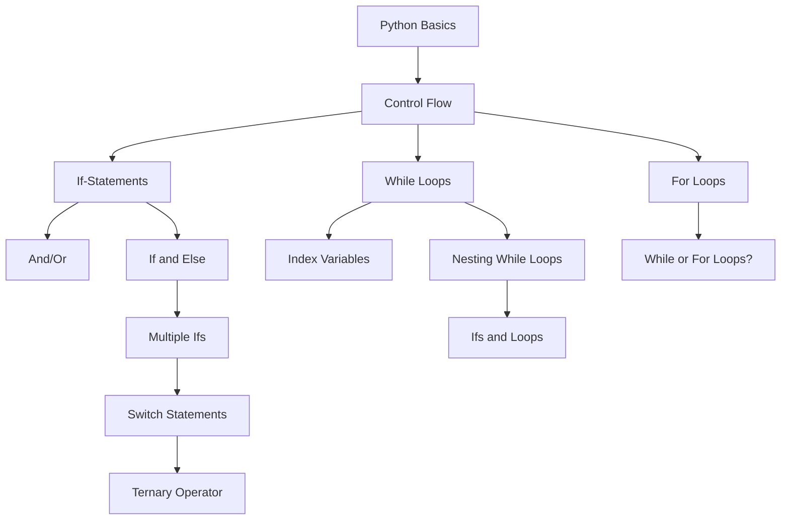

# GloProg (GloVersity) Class 12

Welcome to the repository for GloProg (GloVersity) Class 12, held on -- / -- / ----.

### 1. **For Loop (Revision) 🔄**
- A `for loop` in Python is used to iterate over a sequence (like a list, tuple, or string) and perform a block of code repeatedly.
  
  Example:
  ```python
  numbers = [1, 2, 3, 4]
  for num in numbers:
      print(num)
  ```
  Output:
  ```
  1
  2
  3
  4
  ```

### 2. **Handling Errors in Loops 🚨**
- Errors can happen in loops, especially when handling tricky data. Use `try-except` blocks to catch and manage these errors, ensuring the program keeps running.

  Example:
  ```python
  for i in range(5):
      try:
          result = 10 / (i - 2)  # Causes division by zero when i is 2
      except ZeroDivisionError:
          print(f"Error: Division by zero at i = {i}")
      else:
          print(result)
  ```

### 3. **Error Handling with `try`, `except`, and `finally` ⚠️**
- Use `try-except` to handle specific errors and `finally` to execute code regardless of errors.

  Example:
  ```python
  try:
      number = int(input("Enter a number: "))
      result = 10 / number
  except ZeroDivisionError:
      print("❌ You can't divide by zero!")
  except ValueError:
      print("❌ Please enter a valid number!")
  finally:
      print("✅ This will always run, no matter what!")
  ```

### 4. **Custom Errors with User-Defined Exceptions ✨**
- Create custom exceptions when you want to raise errors that are specific to your program logic.

  Example:
  ```python
  class NegativeNumberError(Exception):
      """Raised when the number is negative."""
      def __init__(self, value):
          self.message = f"❗ Negative number detected: {value}"
          super().__init__(self.message)

  def check_positive_number(num):
      if num < 0:
          raise NegativeNumberError(num)
      return f"{num} is positive."

  try:
      print(check_positive_number(-10))
  except NegativeNumberError as e:
      print(e)
  ```

### 5. **Control Flow (Simple Explanation) 🛤️**
- **Control flow** decides how the code runs. It uses conditions (`if-else`), loops, and functions to decide what happens next.

  Example:
  ```python
  x = 10
  if x > 5:
      print("x is greater than 5")
  else:
      print("x is 5 or less")
  ```
  ### Control Flow in Python




### 6. **Repetition (Loop Usage) 🔁**
- Loops let you repeat code without writing the same thing over and over.

### 7. **Functions (For Avoiding Repeated Code) 🧑‍💻**
- Functions store reusable pieces of code, making it easier to maintain and reduce repetition.

  Example:
  ```python
  def greet():
      print("Hello!")
  
  greet()  # Call it whenever needed
  ```

### 8. **Predefined Functions 🔧**
- Python provides many built-in functions like `print()`, `len()`, and `sum()` that make coding easier.

  Example:
  ```python
  numbers = [1, 2, 3]
  print(len(numbers))  # Outputs the length of the list
  ```

### 9. **Parameters and User-Defined Functions 🎯**
- **Parameters** are like placeholders for data inside a function. You pass values (called arguments) when you call the function.

  Example:
  ```python
  def add_numbers(a, b):
      return a + b
  
  result = add_numbers(3, 5)
  print(result)  # Outputs: 8
  ```

### 10. **Return vs Non-return Functions ↩️**
- **Return functions** give back a result using `return`. Non-return functions do an action but don’t return any value.

  Example:
  ```python
  def square(num):
      return num ** 2
  
  result = square(4)
  print(result)  # Outputs: 16
  ```

### 11. **Arguments 📥**
- **Arguments** are the values you pass to a function. Python supports two types:
  - **Positional arguments**: Arguments must be passed in the right order.
  - **Keyword arguments**: Arguments are passed by name, and order doesn’t matter.

#### Example:
  ```python
  def greet(name):
      print(f"Hello, {name}!")
  
  greet("Wajahat")  # Positional argument
  greet(name="Wajahat")  # Keyword argument
  ```

#### Using `*args` for Positional Arguments:
  ```python
  def print_numbers(*args):
      for num in args:
          print(num)
  
  print_numbers(1, 2, 3, 4)  # You can pass multiple arguments
  ```

#### Using `**kwargs` for Keyword Arguments:
  ```python
  def display_info(**kwargs):
      for key, value in kwargs.items():
          print(f"{key}: {value}")
  
  display_info(name="Wajahat", age=25, country="Pakistan")
  ```

### 12. **Lambda Functions 🌀**
- **Lambda functions** are small anonymous functions that can be written in one line. They’re useful for short operations.

  Example:
  ```python
  square = lambda x: x ** 2
  print(square(5))  # Outputs: 25
  ```

### 13. **Recursive Functions 🔁**
- **Recursive functions** call themselves to solve a problem that can be broken down into smaller parts (like calculating factorials or Fibonacci numbers).

  Example:
  ```python
  def factorial(n):
      if n == 1:
          return 1
      else:
          return n * factorial(n - 1)
  
  print(factorial(5))  # Outputs: 120
  ```

### 14. **Required and Optional Parameters ⚙️**
- **Required parameters** must be provided when calling a function, while **optional parameters** have default values.

  Example:
  ```python
  def greet(name, message="Hello"):
      print(f"{message}, {name}!")
  
  greet("Wajahat")  # Uses default message "Hello"
  greet("Wajahat", "Good morning")  # Custom message
  ```

---